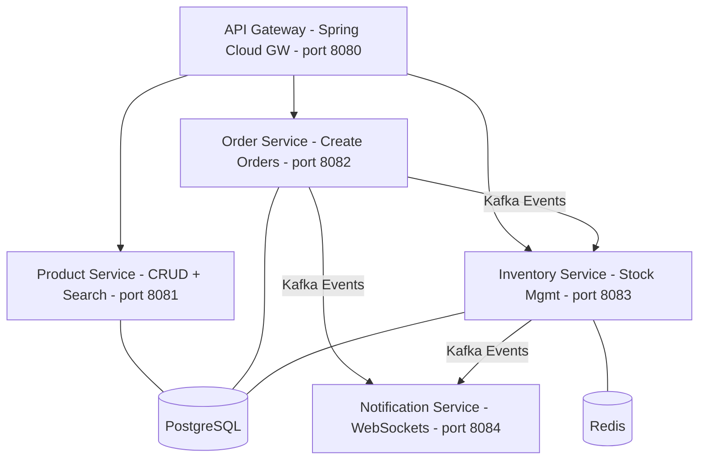
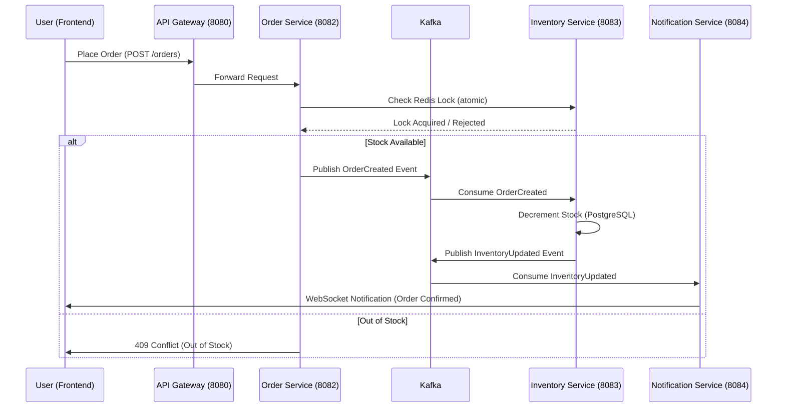
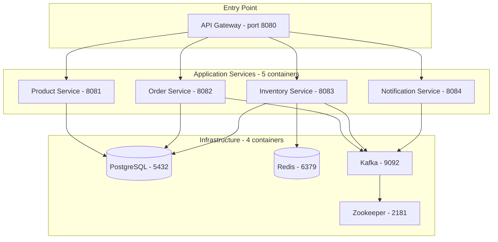
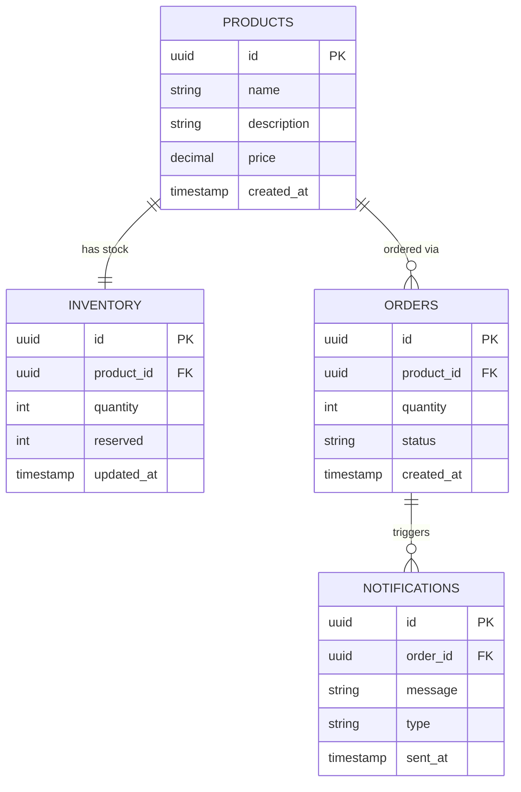

# FlashCart — Real-Time Flash Sale & Inventory Engine

> Distributed e-commerce backend engineered to survive 10k–50k concurrent purchase attempts — with atomic inventory control, event-driven processing, and real-time order feedback.

    

---

## Why FlashCart?

Traditional e-commerce systems break under flash-sale load: databases get overwhelmed, race conditions cause overselling, and users get inconsistent feedback. FlashCart solves this with:

- **Redis atomic operations** — prevent overselling under extreme concurrency
- **Kafka event sourcing** — decouple services and guarantee eventual consistency
- **Distributed microservices** — each service scales and deploys independently
- **WebSocket notifications** — instant, real-time order status updates

---

## Architecture



---

## Request Lifecycle

End-to-end flow of a flash-sale order through the system:



---

## Microservices & Docker

FlashCart is a **true microservices system** — not a monolith split into folders. Every service is a completely independent Spring Boot application with its own codebase, database schema, and Docker container. They share nothing except messages over Kafka and the API Gateway as the single entry point.

**What runs inside Docker Compose**

| Container | Image | Role |
|---|---|---|
| `api-gateway` | Custom Spring Boot | Routes all incoming traffic |
| `product-service` | Custom Spring Boot | Owns product data |
| `order-service` | Custom Spring Boot | Owns order data, Kafka producer |
| `inventory-service` | Custom Spring Boot | Owns stock data, Kafka consumer |
| `notification-service` | Custom Spring Boot | WebSocket push to clients |
| `postgres` | postgres:15 | Persistent source of truth |
| `redis` | redis:7 | Atomic inventory locking |
| `kafka` | confluentinc/cp-kafka:7.5 | Async event bus |
| `zookeeper` | confluentinc/cp-zookeeper:7.5 | Kafka coordination |

That's **9 containers** spun up with a single command.

**Docker Compose network layout**



**Key microservice principles applied**

- **Independent deployability** — any service can be rebuilt and redeployed without touching the others
- **Bounded context** — each service owns its own database tables and never queries another service's DB directly
- **Failure isolation** — if the Notification Service goes down, orders still process; Kafka retains undelivered events
- **Async communication** — services don't call each other over REST (except Gateway → Service); all cross-service workflows go through Kafka events

---

## Database Schema

Each microservice owns its own tables. No cross-service joins — ever.



---

## Services

| Service | Responsibility | Port |
|---|---|---|
| API Gateway | Routing, auth, rate limiting | 8080 |
| Product Service | CRUD + search | 8081 |
| Order Service | Order creation, Kafka producer | 8082 |
| Inventory Service | Stock management, Kafka consumer | 8083 |
| Notification Service | Real-time updates via WebSockets | 8084 |

---

## API Endpoints

All backend services are accessible through the API Gateway on port `8080`.

**API Gateway (8080)**

| Method | Endpoint | Description |
|---|---|---|
| GET | /products | List all products |
| POST | /products | Create product |
| GET | /orders | List all orders |
| POST | /orders | Create order |
| GET | /inventory | List inventory |
| POST | /inventory/reduce | Reduce stock |
| GET | /notifications | List notifications (debug) |

**Product Service (8081)**

| Method | Endpoint | Description |
|---|---|---|
| GET | /api/products | Get all products |
| POST | /api/products | Create a product |
| GET | /api/products/{id} | Get product by ID |

**Order Service (8082)**

| Method | Endpoint | Description |
|---|---|---|
| GET | /api/orders | Get all orders |
| POST | /api/orders | Create order (triggers Kafka event) |

Sample request body:

```json
{
  "productId": 1,
  "quantity": 1
}
```

**Inventory Service (8083)**

| Method | Endpoint | Description |
|---|---|---|
| GET | /api/inventory | Get inventory levels |
| POST | /api/inventory/reduce | Reduce stock manually |

**Notification Service (8084)**

| Method | Endpoint | Description |
|---|---|---|
| GET | /api/notifications | Debug endpoint |
| WS | /ws/notifications | Real-time WebSocket updates |

---

## Tech Stack

**Backend** — Java 17, Spring Boot 3.2, Spring Cloud Gateway, Spring WebFlux, Spring Data JPA, Lombok, Maven Multi-Module

**Infrastructure** — PostgreSQL 15, Redis 7, Kafka 7.5 (Confluent), Zookeeper, Docker & Docker Compose

---

## Quick Start

```bash
# Build all modules
mvn clean install -DskipTests

# Start the full stack (Postgres, Redis, Zookeeper, Kafka, all services)
cd infra
docker compose up --build
```

One command spins up the entire environment.

---

## How It Works

1. A flash sale begins — inventory is locked in **Redis** atomically
2. A user places an order — **Order Service** validates stock and publishes a Kafka event
3. **Inventory Service** consumes the event and decrements stock in PostgreSQL
4. **Notification Service** pushes a real-time update to the user via WebSocket
5. If stock is exhausted, subsequent requests are rejected before hitting the database

---

## Load Testing (k6)

FlashCart is designed for high-concurrency flash-sale scenarios. Use [k6](https://k6.io) to simulate thousands of concurrent buyers.

**Install k6**

```bash
brew install k6
```

**Create `load-test.js`**

```js
import http from 'k6/http';
import { sleep } from 'k6';

export const options = {
  vus: 10000,       // 10k concurrent virtual users
  duration: '30s',
};

export default function () {
  const payload = JSON.stringify({ productId: 1, quantity: 1 });
  const params = { headers: { 'Content-Type': 'application/json' } };
  http.post('http://localhost:8080/orders', payload, params);
  sleep(1);
}
```

**Run the test**

```bash
k6 run load-test.js
```

**What this validates**

- Redis atomic locks prevent overselling under extreme concurrency
- Order Service handles burst traffic without data corruption
- Kafka absorbs event spikes without dropping messages
- Inventory Service processes events reliably and in order
- System remains consistent across all services under load
